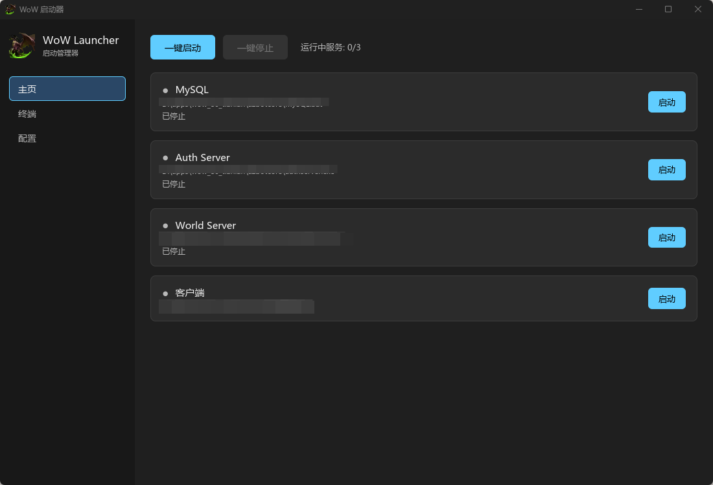

# WoW Launcher

Rust + iced 编写的 Windows 桌面启动器，用于**一键拉起 / 停止 WoW 服务端三件套（MySQL · Auth Server · World Server）与游戏客户端**，并为三个后端服务提供内置的可视化终端（实时输出、彩色日志、键盘交互）。



## 功能特性

- **一键启动**：自动按序启动 MySQL → 轮询 3306 端口就绪 → 并发启动 Auth / World Server，全程状态可视化
- **一键停止**：杀掉全部服务**进程树**（正确处理 `MySQL.bat` 这类 cmd→真实进程 的两级包装，不留孤儿进程）
- **单独控制**：每个后端服务可独立 启动 / 停止 / 重启
- **内置终端**：
  - 基于 **ConPTY 伪终端 + vt100 全屏仿真**，输出逐字节实时到达、完整保留 ANSI 彩色日志
  - 支持 16 色 / 256 色 / 真彩色、背景色、反显、粗体、下划线（Tokyo Night 配色）
  - 滚轮 / Shift+PgUp/PgDn 回看 2000 行历史，键盘输入自动回到实时屏
  - 支持直接在终端里操作 worldserver 控制台命令（如 `server info`）
- **退出保护**：关窗时若有服务在运行会弹确认框；所有子进程挂入 Windows 作业对象，启动器无论正常退出还是被强杀，进程树都会被系统回收，**不残留孤儿进程**
- **配置持久化**：4 个应用路径保存到 exe 同目录的 `wow_launcher.json`
- **客户端独立运行**：`wow.exe` 以独立进程启动、输出完全压制，不受启动器生命周期影响

## 适用范围

| 项 | 说明 |
|---|---|
| 操作系统 | Windows 10（1809 及以上）/ Windows 11（x64），无需安装任何额外运行库 |
| 服务端 | AzerothCore 及兼容结构的服务端三件套（`mysqld.exe` / authserver / worldserver，支持 `.exe`、`.bat`、`.cmd`） |
| 客户端 | 任意 `wow.exe`（仅负责拉起，不做版本管理） |
| 部署形态 | **本机单机**部署（服务和启动器在同一台机器）；不支持远程服务器管理 |

## 使用方法

1. 将 `wow_launcher.exe` 放到任意可写目录（首次运行会在同目录生成 `wow_launcher.json`）
2. 打开「配置」页，分别设置 MySQL / Auth Server / World Server / 客户端的可执行文件路径（支持 `.exe/.bat/.cmd`），点「保存配置」
   - MySQL 通常指向 `mysqld.exe` 或包装它的 `MySQL.bat`
3. 回到「主页」：
   - 点 **一键启动** 自动完成整套启动序列（也可对单个服务点「启动」）
   - 点 **一键停止** 结束全部后端服务
4. 切到「终端」页可实时查看三个服务的输出、敲 worldserver 控制台命令、滚轮回看历史
5. 直接关窗时若仍有服务在运行，会提示是否停止并退出

## 从源码构建

```powershell
# 需要 stable-x86_64-pc-windows-msvc toolchain + VS Build Tools 2022+(C++ 桌面开发)
rustup default stable-x86_64-pc-windows-msvc
cargo build --release     # 产物: target\release\wow_launcher.exe（静态链接 CRT，自包含单文件）
cargo test                # 单元测试 + ConPTY 端到端测试
```

产物为单个 exe（约 13MB），不依赖 VCRUNTIME redist，可直接复制部署。

## 技术栈

| 组件 | 用途 |
|---|---|
| [iced](https://github.com/iced-rs/iced) 0.14 | GUI 框架（Elm 架构） |
| [portable-pty](https://github.com/wez/wezterm) | 调用系统自带的伪控制台接口实现内置终端 |
| vt100 0.16 | 终端全屏仿真（彩色日志解析 + 历史回看） |
| tokio | 异步任务（端口轮询、延时重启） |
| rfd / serde / image | 文件对话框 / JSON 配置 / 图标解码 |

开发者文档见 [AGENTS.md](AGENTS.md)，终端设计细节见 [docs/terminal-input-vt100-emulation.md](docs/terminal-input-vt100-emulation.md)。

## 常见问题

- **启动报 error 126 / 找不到模块**：确认使用 msvc toolchain 且 `.cargo/config.toml` 的 crt-static 生效
- **一键启动按钮灰色**：三个后端服务路径必须全部配置并保存
- **终端无输出**：确认服务路径指向的是控制台程序；本启动器通过 ConPTY 捕获，普通管道程序输出不会被吞
- **修改源码后 `cargo clean` 报 os error 32**：先在任务管理器结束残留的 `wow_launcher.exe`
